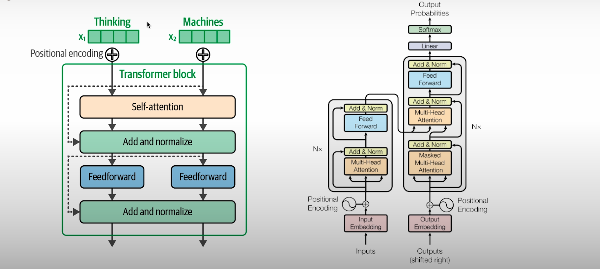
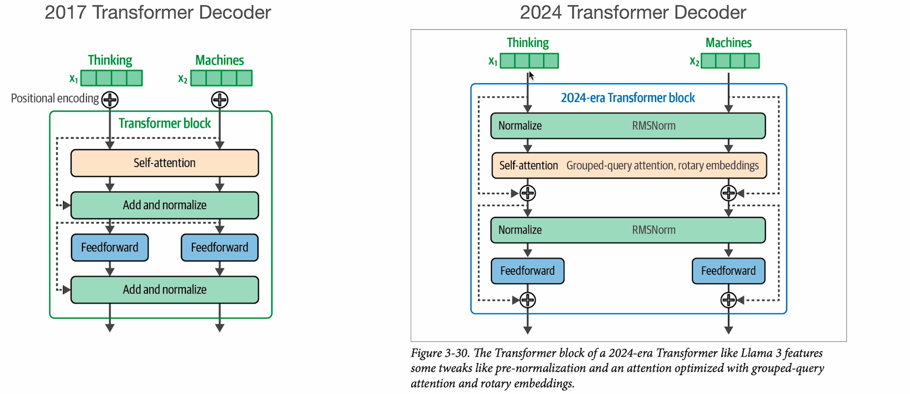

# How_Transformer_LLMs_Work
* Gain an understanding of the key components of transformers, including tokenization, embeddings, self-attention, and transformer blocks, to build a strong technical foundation.

* Understand recent transformer improvements to the attention mechanism such as KV cache, multi-query attention, grouped query attention, and sparse attention.

* Compare tokenization strategies used in modern LLMS and explore transformers in the Hugging Face Transformers library. \
  

